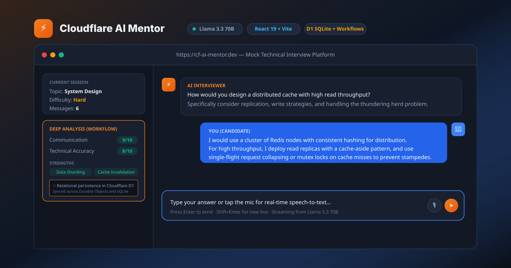

# Cloudflare AI Mentor ⚡

An enterprise-grade, full-stack AI technical interview coach running entirely on Cloudflare's edge platform and powered by Llama 3.3 70B, React 19, Cloudflare D1 (SQLite), Durable Objects, and Cloudflare Workflows.

[](https://cf-ai-mentor.dev)

[](https://react.dev)
[](https://vitejs.dev)
[](https://www.typescriptlang.org)
[](https://workers.cloudflare.com)
[](https://developers.cloudflare.com/workers-ai/)
[](https://developers.cloudflare.com/d1/)
[](https://developers.cloudflare.com/durable-objects/)
[](https://developers.cloudflare.com/workflows/)
[](https://vitest.dev)
[](https://github.com/SrinivasaChivukula/cf_ai_mentor/actions)
[](LICENSE)

🌐 **Production Domain:** [https://cf-ai-mentor.dev](https://cf-ai-mentor.dev)  
⚡ **Edge Workers URL:** [https://cf-ai-mentor.lucifer96389.workers.dev](https://cf-ai-mentor.lucifer96389.workers.dev)

---

## What it does

Pick a topic (DSA, System Design, Full Stack, Distributed Systems, etc.), pick a difficulty, and get dropped into a mock technical interview. The AI coach asks questions one at a time, evaluates your answers in real time, and tracks conversational context across the session.

Whenever you want, trigger a deep multi-step analysis pipeline that grades your communication and technical accuracy, identifies knowledge gaps, and recommends targeted follow-ups. All interview records and performance metrics persist across both in-memory state and Cloudflare D1 SQL storage for comprehensive analytics.

### Key Features:
- **Edge LLM Streaming**: Real-time token streaming from Llama 3.3 70B FP8 via Cloudflare Workers AI.
- **Modern React 19 Frontend**: Built with Vite, TypeScript, and Lucide icons for responsive, lightning-fast UI.
- **Relational Analytics Dashboard**: Built-in metrics modal tracking average scores, evaluations, and sessions powered by Cloudflare D1.
- **Hybrid Edge Persistence**: Durable Objects handle real-time transactional session state, while Cloudflare D1 SQLite stores relational session metadata, message logs, and scoring analytics.
- **Automated AI Workflows**: Cloudflare Workflows orchestrates a 4-step autonomous evaluation pipeline with retry resilience.
- **Voice-Enabled Interviewing**: Hands-free practice via the Web Speech API with real-time speech-to-text transcription.
- **Enterprise CI/CD & Automated Testing**: Full Vitest test suite running locally and on GitHub Actions with automated deployment on merge.

---

## Architecture

```
React 19 + Vite Frontend (dist/)
  │
  ├── User prompts & Voice transcription
  │
  ▼
Cloudflare Worker (src/worker/index.ts)
  │
  ├── /api/chat ───────────► Workers AI (Llama 3.3 70B FP8, streaming SSE)
  │                           └─ Syncs messages to Cloudflare D1 (SQLite)
  │
  ├── /api/analyze ────────► Cloudflare Workflow (CoachingWorkflow)
  │                            ├─ Step 1: Deep evaluation with Llama 3.3
  │                            ├─ Step 2: Adaptive follow-up generation
  │                            ├─ Step 3: Save analysis to Durable Object
  │                            └─ Step 4: Persist evaluation record to D1
  │
  ├── /api/session/:id ────► Durable Object (SessionStore)
  │                            └─ Active in-memory session history (last 50 msgs)
  │
  ├── /api/analytics ──────► Cloudflare D1 (SQLite)
  │                            └─ Aggregated scores, evaluations, sessions
  │
  └── /* ──────────────────► Cloudflare Assets (Static React build)
```

| Component | Technology | Role |
|---|---|---|
| **Frontend** | React 19, Vite, TypeScript | Interactive UI, voice transcription, analytics visualization |
| **Edge Compute** | Cloudflare Workers | Serverless edge runtime, API gateway, routing |
| **Model Serving** | Workers AI (Llama 3.3 70B FP8) | Edge LLM inference and streaming evaluation |
| **Session State** | Durable Objects (`SessionStore`) | In-memory transactional session state and quick recall |
| **Relational DB** | Cloudflare D1 (`cf-ai-mentor-db`) | Persistent SQLite storage for sessions, messages, and evaluations |
| **Orchestration** | Cloudflare Workflows (`CoachingWorkflow`) | Multi-step background pipeline for evaluation scoring |
| **Testing** | Vitest | Unit & integration test suite for Workers and Durable Objects |
| **CI / CD** | GitHub Actions | Automated lint, typecheck, test, build, and zero-downtime deploy |

---

## Project Structure

```
cf_ai_mentor/
├── .github/
│   └── workflows/
│       └── ci.yml                 # GitHub Actions CI/CD workflow
├── docs/
│   └── demo-preview.svg           # High-resolution UI banner graphic
├── migrations/
│   └── 0001_initial_schema.sql    # D1 SQLite schema (sessions, messages, evaluations)
├── src/
│   ├── frontend/
│   │   ├── src/
│   │   │   ├── components/
│   │   │   │   ├── AnalyticsModal.tsx  # D1 performance & scoring dashboard
│   │   │   │   ├── ChatArea.tsx        # Message feed & markdown rendering
│   │   │   │   ├── InputArea.tsx       # Message input + Web Speech API voice button
│   │   │   │   ├── SetupModal.tsx      # Topic & difficulty selection modal
│   │   │   │   └── Sidebar.tsx         # Sessions list & navigation
│   │   │   ├── App.tsx                 # Core application state & API hooks
│   │   │   ├── main.tsx                # React DOM root mounting
│   │   │   ├── styles.css              # Custom styling & glassmorphism theme
│   │   │   ├── types.ts                # Shared TypeScript interfaces
│   │   │   └── vite-env.d.ts           # Vite client environment types
│   │   └── index.html             # Vite entry HTML
│   └── worker/
│       ├── index.ts               # Worker API routes & CoachingWorkflow
│       └── session-store.ts       # SessionStore Durable Object class
├── test/
│   ├── mocks/
│   │   └── cloudflare-workers.ts  # DurableObject mock for Node test environments
│   └── worker.spec.ts             # Vitest test suite for Worker routes & DO
├── package.json                   # Dependencies, build scripts, & test runner
├── tsconfig.json                  # TypeScript compiler options
├── vite.config.ts                 # Vite bundler configuration & dev proxy
├── vitest.config.ts               # Vitest configuration & module aliases
├── wrangler.toml                  # Cloudflare Worker, D1, DO, & Workflow bindings
├── PROMPTS.md                     # LLM prompt engineering guidelines
└── README.md                      # Project documentation
```

---

## API Reference

| Endpoint | Method | Description |
|---|---|---|
| `/api/chat` | `POST` | Streams token response from Llama 3.3 via SSE and syncs to D1 |
| `/api/analyze` | `POST` | Initiates autonomous 4-step `CoachingWorkflow` |
| `/api/workflow/:id` | `GET` | Queries workflow execution status and step results |
| `/api/session/:id` | `GET` | Fetches active session transcript and statistics from Durable Object |
| `/api/session/:id` | `DELETE` | Removes session state from Durable Object and cascades deletion in D1 |
| `/api/session/:id/analysis` | `GET` | Retrieves the latest evaluation scorecard |
| `/api/sessions` | `GET` | Lists recent interview sessions with D1 metadata |
| `/api/analytics` | `GET` | Returns aggregated score statistics, evaluations, and overall metrics from D1 |

---

## Getting Started

### Prerequisites
- **Node.js**: v18.0.0 or later
- **Cloudflare Account**: Free tier or higher
- **Cloudflare Wrangler CLI**: Installed globally or via `npx`

### 1. Clone & Install
```bash
git clone https://github.com/SrinivasaChivukula/cf_ai_mentor.git
cd cf_ai_mentor
npm install
```

### 2. Setup Cloudflare D1 Database
Create the remote D1 SQLite database and apply migrations:
```bash
# Create the D1 database
npx wrangler d1 create cf-ai-mentor-db

# Apply migrations locally
npx wrangler d1 migrations apply cf-ai-mentor-db --local

# Apply migrations to production (remote)
npx wrangler d1 migrations apply cf-ai-mentor-db --remote
```
*(Copy the generated `database_id` into your `wrangler.toml` if creating a new database instance).*

### 3. Run Automated Tests
```bash
# Run the Vitest test suite
npm test

# Run TypeScript typechecks
npm run typecheck
```

### 4. Build Frontend & Run Local Dev Server
```bash
# Build the React 19 frontend into dist/
npm run build

# Log in to Cloudflare
npx wrangler login

# Start local worker dev server (remote flag required for Workers AI inference)
npm run dev
```

Open [http://localhost:8787](http://localhost:8787) in your browser.

---

## Custom Domain Setup

To point your custom domain (e.g. `cf-ai-mentor.dev`) to your Cloudflare Worker:

### Option A: Via Cloudflare Dashboard
1. Navigate to the **Cloudflare Dashboard** → **Workers & Pages**.
2. Select `cf-ai-mentor` → **Settings** → **Domains & Routes**.
3. Click **Add** → **Custom Domain** and enter `cf-ai-mentor.dev`.
4. Cloudflare automatically provisions the SSL certificate and creates DNS routing records.

### Option B: Via `wrangler.toml`
Add the custom route to your `wrangler.toml`:
```toml
routes = [
  { pattern = "cf-ai-mentor.dev/*", zone_name = "cf-ai-mentor.dev" }
]
```

---

## CI/CD Pipeline

Every pull request and push to `main` triggers the automated GitHub Actions workflow [`.github/workflows/ci.yml`](.github/workflows/ci.yml):

1. **Typecheck**: Validates TypeScript compilation across frontend and worker.
2. **Unit Tests**: Executes the Vitest test suite.
3. **Build**: Bundles the React 19 single-page application with Vite.
4. **Deploy**: Automatically deploys the Worker, Durable Objects, Workflows, and Assets to Cloudflare on `main` branch merges (requires repository secret `CLOUDFLARE_API_TOKEN`).

---

## License

MIT © [Srinivasa Chivukula](https://github.com/SrinivasaChivukula)
